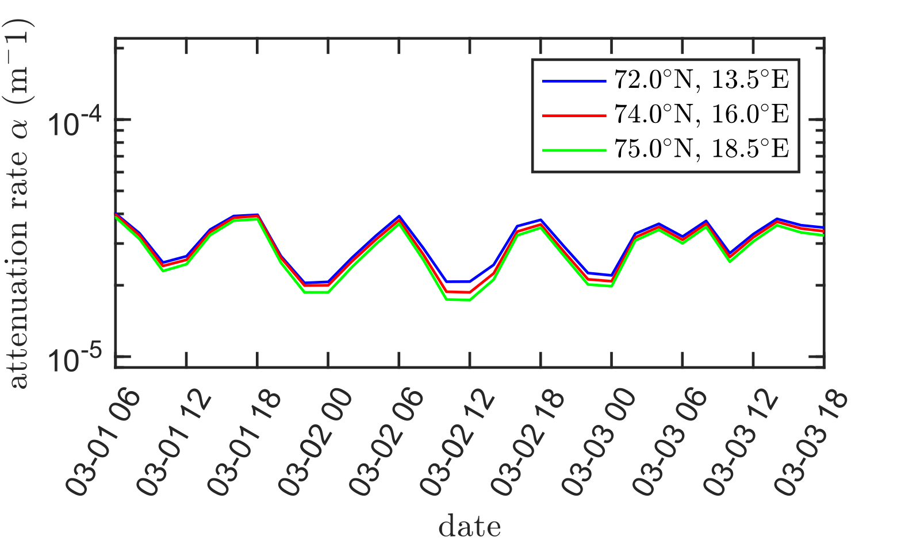

# Code release article_data_modulated_attenuation_waves_in_ice_2021_03

The data, code, and supporting evidence for our paper about wave in ice modulated attenuation East of Svalbard, observed in in-situ buoy data from 2021-03.

Link to the paper: [https://egusphere.copernicus.org/preprints/2024/egusphere-2024-2619/](https://tc.copernicus.org/articles/19/6229/2025/) .

## Paper erratum

- Fig. 10 has a typo / bug in the XTicks, the correct figure is:

